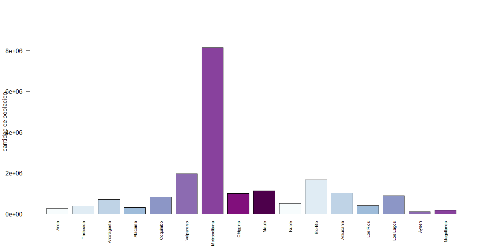

# Proyecto de Tesis: Sistema de monitodeo de la pandemia de covid-19 en Chile u tilizando métodos de Change-Point. ClusterPoint
datos de covid-19

###A continuación un ejemplo de ASMODEE (Jombart et. al) 


## Análisis Descriptivo
```{r,echo=FALSE,results='asis'}
ftregion<-read.csv("newftregion.txt",sep=";",header=T)
ftregion=ftregion[which(as.Date(ftregion$fch_confirmado)="2021-11-20"),]

regiones=c("Tarapaca","Antofagasta","Atacama","Coquimbo","Valparaiso","Ohiggins","Maule","Bio-Bio","Araucania","Los Lagos","Aysen","Magallanes","Metropolitana","Los Rios","Arica","Nuble")
df=data.frame("Region"=regiones,"id_region"=1:16,"poblacion"=ftregion$cant_poblacion[2:17])

df=df[c(15,1:5,13,6:7,16,8:9,14,10:12),]
barplot(df[,3],main="",xlab="",ylab="cantidad de poblacion",ylim=c(0,9000000), names.arg=df[,1],cex.names=0.7,las=2,col=brewer.pal(9, "BuPu"))

```


